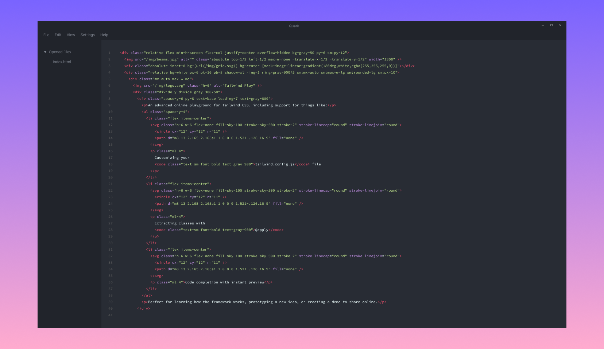

# Quark

A fast and beautiful editor, powered by `pywebview` and `Python`. Download it and try it out [here](release_notes/release-0.1.1-alpha.md).



_Note: this is just a mockup, Quark is WIP_

## Announcement :warning:

Quark is undergoing a redesign and a complete UI overhaul and being heavily developed to reach production-ready level. Expect a **lot** of breaking changes!

## Overview

Quark is a hackable, minimalist code editor. Unlike electron-based editors, it doesn't suffer from node package bloat. And, unlike most widget-based editors, its UI is polished and modern.

Here's what Quark offers:

* Fast file opening speeds, even on very large files (More testing needed to verify this!)
* Minimal memory use
* File autosaving
* Syntax highlighting of most languages
* Basic autocomplete
* Classic One Dark theme
* Minimalist and distraction-free feature set

Learn more about Quark on its [website](https://songtech-0912.github.io/Quark/).

### Usage

Keyboard shortcuts: see https://github.com/ajaxorg/ace/wiki/Default-Keyboard-Shortcuts

### FAQ

* How is Quark different from an editor that I'm used to?

Unlike most text editors, the main point of using Quark isn't to have all the best and coolest features. Instead, it's meant to be distraction-free and minimalist. It makes you focus on the code that you're writing, *not* what you write the code with.

* Why is \<insert feature here\> not available?

Quark is *designed* to be extremely minimal, with very few configuration options. That being said tho, most features you'd expect out of a modern editor (like search and replace) are built-in.

* I want to use Quark for my own projects. Can I do that?

Yes, sure! Because Quark is free and open-source software, you're more than welcome to use it for personal purposes. You can even sell it, really, do whatever you want with it!

## Download & Install

Ready-to-use binaries are not yet available for Quark, though they are in process of being developed. For now, running from source is the primary option.

### Get the source code

You must have `git` preinstalled to do this. For information on how to install `git`, read [this](https://git-scm.com/book/en/v2/Getting-Started-Installing-Git) page.

Assuming that you have `git`, run this command:

```
git clone https://github.com/Songtech-0912/Quark
cd Quark
```

### Running from source

You don't actually need to compile Quark for it to run. You just need to have `python` and `pip` installed.

Once you have Python and Pip installed, just run this:

```
pip install -r requirements.txt
```

On Mac and Linux:

```
cd src
./quark
```

On Windows:

```
cd src
python quark
```

## Contributing

To contribute, you can do any of these things:

* Give suggestions about the project: send me an email at almey0721@gmail.com
* Report bugs: open a new issue and write about an issue you faced
* Write documentation (coming soon!): Work on Quark's documentation (once it's available)
* Add a pull request to make your personal changes to Quark

## License


Quark is dedicated to the public domain. No limitations apply to using, sharing, or distributing the app.
