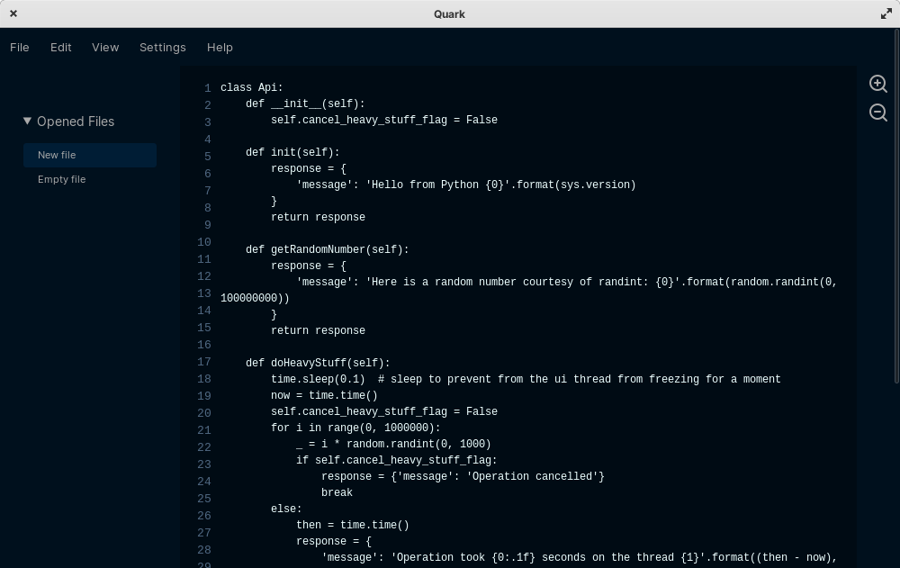

# Quark

A fast and beautiful editor, powered by `pywebview` and `Python`. Download it and try it out [here](release_notes/release-0.1.1-alpha.md).

## Announcement :warning:

Quark is undergoing a redesign and a complete UI overhaul. All frontend code will be rewritten from scratch with OpenGL and `Pyglet` for speed. The main goal of this refactoring is to make Quark fully responsive, and to improve the UI design to match modern standards. You can see my design progress [here](https://www.figma.com/file/mtD74sP2xBowI0fK4n1rZU/Quark-Mockups?node-id=0%3A1). Once V2 is released, Quark will also change to a public domain license for minimal licensing hassle.

## Overview



Quark is a hackable, minimalist code editor. Unlike electron-based editors, it doesn't suffer from node package bloat. And, unlike most widget-based editors, its UI is polished and themable.

Here's what Quark offers:

* Fast file opening speeds, even on very large files (More testing needed to verify this!)
* Minimal memory use
* File autosaving
* Syntax highlighting of most languages (Will come soon!)
* Support for multiple themes (Will come soon!)
* Minimalist and distraction-free feature set

Learn more about Quark on its [website](https://songtech-0912.github.io/Quark/).

### Built with

* HTML & CSS (no SASS or LESS)
* Mostly (>96%) vanilla javascript, with no libraries (except for `keyboard.js`)
* Python & `pywebview`

### FAQ

* How is Quark different from an editor that I'm used to?

Unlike most text editors, the main point of using Quark isn't to have all the best and coolest features. Instead, it's meant to be distraction-free and minimalist. It makes you focus on the code that you're writing, *not* what you write the code with.

* Why is \<insert feature here\> not available?

Quark is *designed* to be extremely minimal, with very few configuration options. With that being said though, many features (e.g. find and replace) will come in the future releases.

* I want to use Quark for my own projects. Can I do that?

Yes, sure! Because Quark is free and open-source software, you're more than welcome to use it for personal purposes. You can even sell it, as long as you place no limitations upon its use.


## Download & Install

If you want a ready-to-use version of Quark, grab the latest version from the [releases page](https://github.com/Songtech-0912/Quark/releases).

Otherwise, follow these steps:

### Get the source code

You must have `git` preinstalled to do this. For information on how to install `git`, read [this](https://git-scm.com/book/en/v2/Getting-Started-Installing-Git) page.

Assuming that you have `git`, run this command:

```
git clone https://github.com/Songtech-0912/Quark
cd Quark
```

### Running from source

You don't actually need to compile Quark for it to run. You just need to have `python` and `pip` installed.

First, install `python` from [its website](https://www.python.org/downloads/).

Next, get `pip` from [here](https://pip.pypa.io/en/stable/installing/).

Once you have Python and Pip installed, just run this:

```
pip install pywebview
```

```
cd src
python main.py
```

### Compiling executables

Compiling executables requires `pyinstaller`. Get `pyinstaller` like this:

```
pip install pyinstaller
```

Once you have `pyinstaller` installed, open a terminal in your `Quark` source code directory. Paste this command in:

```
python -m eel main.py gui --onefile --noconsole --name Quark --exclude pyinstaller
```

### With a Virtual Environment (Currently MacOS and GNU/Linux only)

You can use a virtual environment to run pyinstaller (especially if you have a lot of Python packages). To do this, open a terminal in your `Quark` source code directory, and enter in this:

```
cd ..
```

Then enter in this in your terminal (without the dollar signs):

```
$ cp Quark env
$ python3 -m venv env
$ source env/bin/activate
```

We have to install `pyinstaller` and `eel` before doing any compiling. Use the same commands as before, or copy the two listed below (without dollar signs):

```
$ pip install eel
$ pip install pyinstaller
```

Now, you're ready to start compiling. To compile, enter the main folder, and run the same `pyinstaller` command as before:

```
cd env
python -m eel main.py gui --onefile --noconsole --name Quark --exclude pyinstaller
```

Your compiled executable will be located in `./dist`.

## Problems

### Known Issues

Quark is known to suffer from several issues, listed below:

* Paste errors
* File being edited is not highlighted
* Font/rendering issues

If you find any other issues, please open an issue on Github. I would greatly appreciate it.

### Troubleshooting

Had a problem installing or running Quark? Here are some ways to solve it

* Close localhost ports

By default, Quark will use any opened port for its GUI, but if that isn't possible, you can try closing all localhost ports

* Install Chrome/Chromium/any Blink-based browser

Quark will work best with Chrome/Chromium preinstalled. Some of its features may not work if you don't have it.

* Launch Quark from terminal

Open up a terminal and `cd` into the folder where you downloaded Quark. Give it executable priviledges with `chmod a+x`. Then run `./Quark` or `Quark` (depending on your OS) to launch it.

## Contributing

To contribute, you can do any of these things:

* Give suggestions about the project: send me an email at jacky.song1020@gmail.com
* Report bugs: open a new issue and write about an issue you faced
* Write documentation (coming soon!): Work on Quark's documentation (once it's available)
* Add a pull request to make your personal changes to Quark

## License


Quark is released under the [GNU GPLv3 license](https://www.gnu.org/licenses/gpl.html) (or any future versions of the license).


The terms of the license are, in brief:
 * Once you download Quark, you own it forever
 * You may use Quark without restriction
 * You may make modifications to its source code
 * You may publish your changes as long as you cite the original work
 * Quark will always remain free(libre) software
